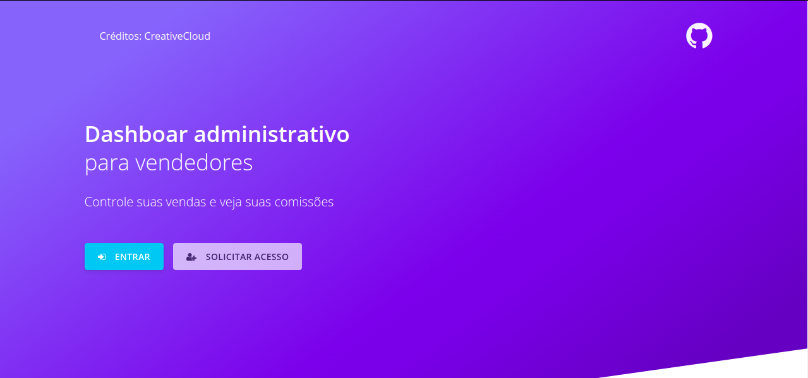
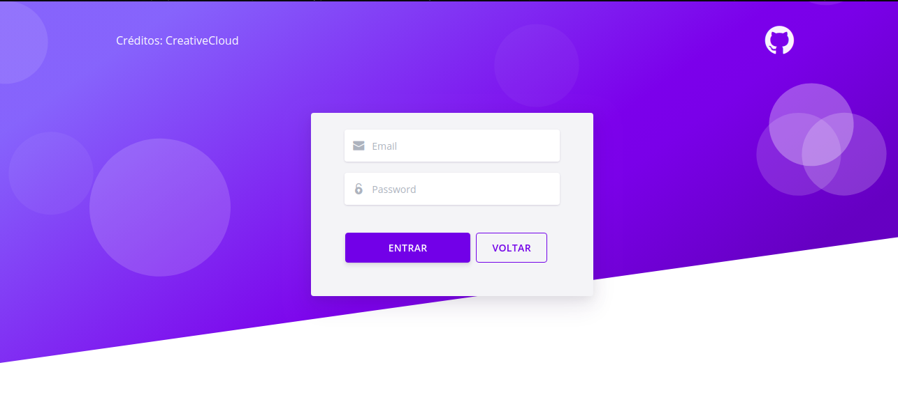
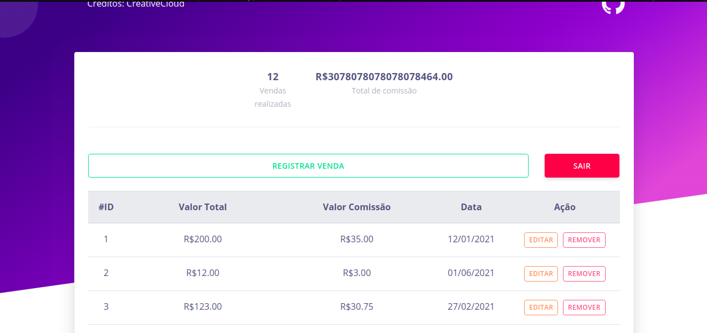
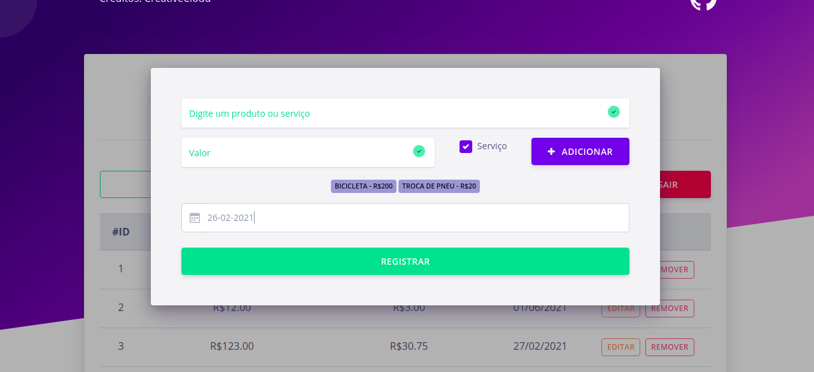
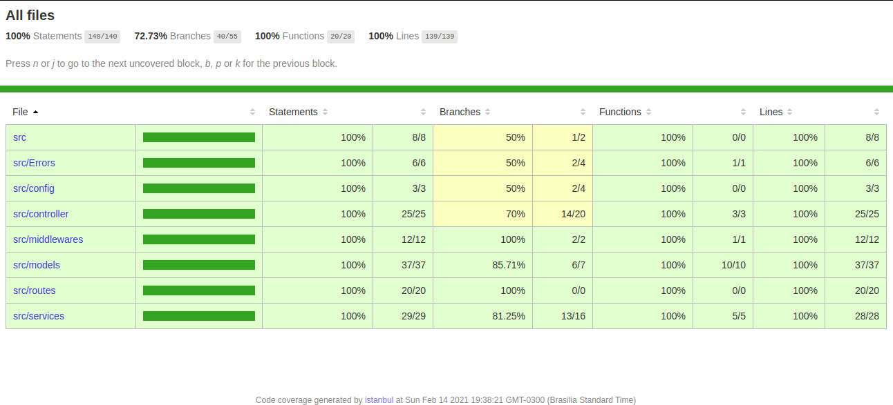

# Sales People App
The project allows you to register your sales and check your commissions.

## Technologies
- NodeJS with Express.
- Postgres with Sequelize.
- Test of integration with Jest.
- Frontend with VueJS.

## User access:
- email: admin@admin.com.br
- password: admin

## Starting
To run the project, you will need to install the following programs

- [Docker](https://docs.docker.com/get-docker/)

## Development

Clone the repository for your machine.

```shell
git clone https://github.com/gabrielmussolini984/app-salespeople.git
```

### Construct

To run the project with the docker-compose: (in frontend and backend folder)

```shell
docker-compose up
```

The command will upload all the services necessary for the application to work.

### Using application FRONTEND:
Is necessary run api in backend folder, run `cd backend && docker-compose up`
Is necessary run app in frontend folder, run `cd frontend && docker-compose up`
Access page in: http://localhost:8080

### Testing API
[POST] http://localhost:3000/session
- Create access token, need pass email and password.
``` JSON
{
	"email": "admin@admin.com.br",
	"password": "admin"
}
```
[GET] http://localhost:3000/sale
- Search all you sales, with total and total comission.

[POST] http://localhost:3000/sale
- Create a sale, need pass products and date the gain sale.
ps: Need pass Authorization Bearer in header.
``` JSON
{
"sale_date": "2021-01-13",
"products": [
	{ "name": "Service1", "service": true, "value": 100 },
	{ "name": "Product1", "service": false, "value": 100 }
]
}
```

### Run tests
- Run `docker exec -it backend_web /home/node/app/ && npm test -- --runInBand`
## Features
In this project, we can enter an account already created, register sales that already calculate the earnings with commission.


### Page: Intro

### Page: Login

### Page: Dashboard

### Page: Form

### Coverage Tests

#### Thanks!

